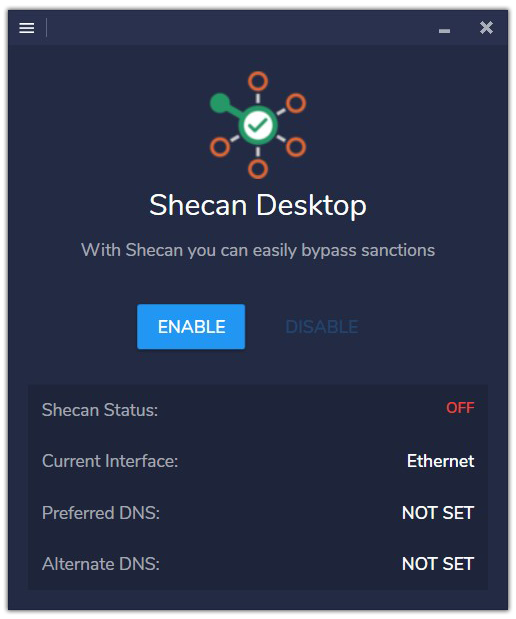
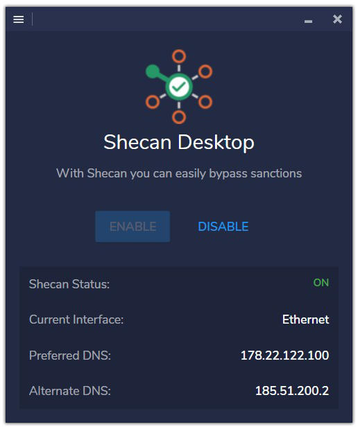

# Shecan Desktop (Unofficial)

Simple Windows application for Shecan service (See [Shecan.ir](https://shecan.ir) for more information).

## Build Instructions

1. Install Visual Studio 2015
2. Clone or download the project files
3. Open the project solution file (ShecanDesktop\Source\ShecanDesktop.sln)
4. Restore the packages
5. Build

## Create Setup

After doing following steps, you can get the Setup.exe in Setup\Output directory.

1. Install Inno Setup
2. Build app in release mode
3. Run SetupShell.ps1 file in Setup directory
4. Compile Inno Setup config file (SetupConfig.iss) in Setup directory

## Third-Party

1. Fody.4.2.1
2. PropertyChanged.Fody.2.6.1
3. MaterialDesignThemes.2.5.1
4. MaterialDesignColors.1.1.3
5. MahApps.Metro.1.6.0
6. ControlzEx.3.0.2.4
7. Microsoft.PowerShell.3.ReferenceAssemblies.1.0.0
8. Newtonsoft.Json.12.0.2

## Screenshots

